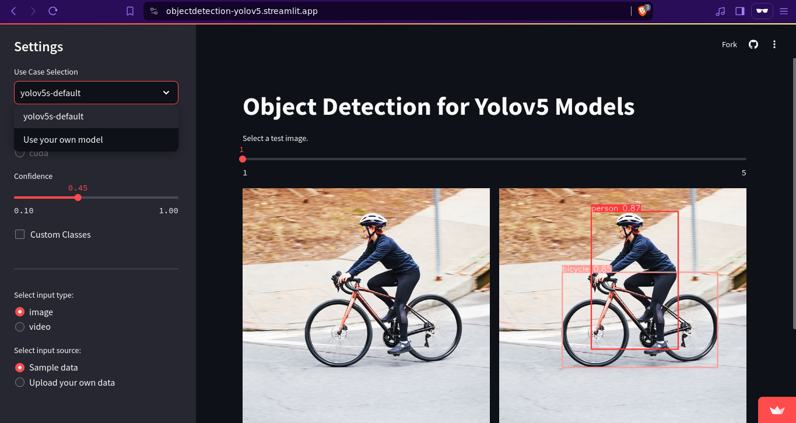

# Streamlit YOLOv5 Object Detection  Web App

## Link
- [Site](https://objectdetection-yolov5.streamlit.app/)

## Overview

This web app allows users to run object detection using the YOLOv5s default model or upload a custom trained YOLOv5 model for checking purposes. The app is built using Streamlit. 


## Features

- **Default YOLOv5s Model**: Run object detection using the pre-trained YOLOv5s model.
- **Custom YOLOv5 Model**: Upload and run object detection using your custom trained YOLOv5 model.
- **User-Friendly Interface**: Simple and intuitive interface built with Streamlit.
- **Real-time Results**: Get instant feedback on the uploaded images or videos.

## Installation

To run this app locally, follow these steps:

1. **Clone the repository:**
   ```sh
   git clone https://github.com/yourusername/streamlit-yolov5-app.git
   cd streamlit-yolov5-app
   ```

2. **Create a virtual environment:**
   ```sh
   python -m venv venv
   source venv/bin/activate  # On Windows use `venv\Scripts\activate`
   ```

3. **Install the required packages:**
   ```sh
   pip install -r requirements.txt
   ```

4. **Run the app:**
   ```sh
   streamlit run app.py
   ```

## Usage

### Default YOLOv5s Model

1. Open the app in your browser.
2. Select the **Default Model** option.
3. Upload an image or video. (Choose **Upload your own data**)
4. View the detection results.

### Custom YOLOv5 Model

1. Open the app in your browser.
2. Select the **Use your own model** option.
3. Upload your custom trained YOLOv5 model (.pt file).
4. Upload an image or video. (Choose **Upload your own data**)
5. View the detection results.

## Contributing

Contributions are welcome! Please open an issue or submit a pull request for any improvements or bug fixes.


